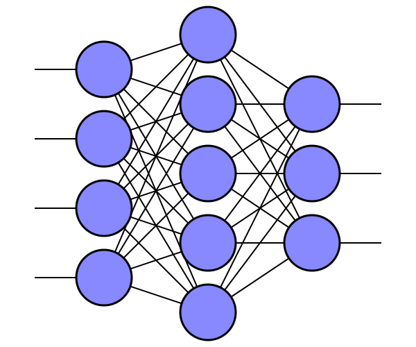

# createNNsvg
Python script to automate creation of SVG of Neural Network of arbitrary size. 

The script is currently limited to 1 input layer, one hidden layer and 1 output layer. By editting the script you can choose the number of input, hidden and output nodes, their positions and spacings. 

## Example

